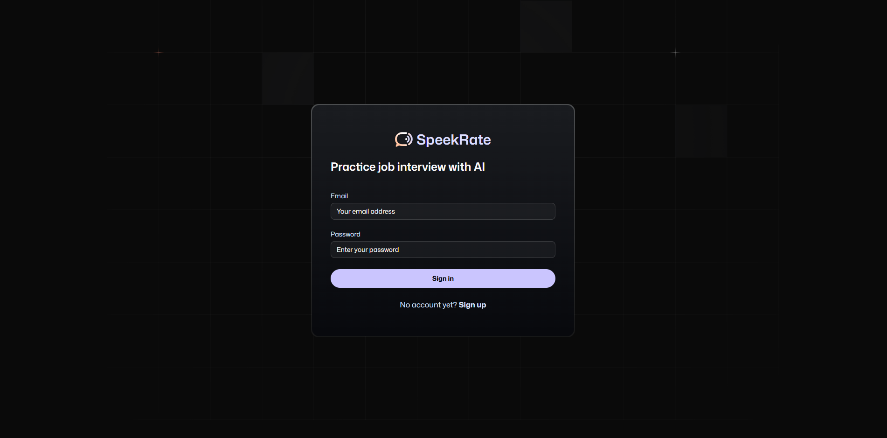

# SpeekRate AI

  

Speekrate AI is an interactive platform for English interview preparation—whether they are technical, behavioral, or even a mix of both.
Supported by an **AI agent (Vapi)**, users can:

- Create personalized interviews.  
- Conduct interviews they've created themselves or those made by other users. 
- Train both communication and technical skills.
- Receive feedback provided by an AI agent.

---

## 🚀 Demonstration

🔗 [Access the project on Vercel](https://speekrate-ai.vercel.app/)

---

## 📦 Technologies Used

- **[Next.js 15](https://nextjs.org/)** with **React 19**
- **[Tailwind CSS 4](https://tailwindcss.com/)** + animations
- **[React Hook Form](https://react-hook-form.com/)** + **Zod** for validations
- **[Firebase](https://firebase.google.com/)** (auth & storage)
- **[Vapi AI](https://vapi.ai/)** for integration with AI Agent
- **Lucide React** (icons)
- **Day.js** (datas)

---

## 🖼️ Architecture

```mermaid
flowchart TD
    U[👤 Usuário] -->|Accesses interview| N[🌐 Next.js Frontend]
    N -->|Authentication / Database| F[🔥 Firebase]
    N -->|AI conversation| V[🤖 Vapi AI]
    F -->|Stores interviews| DB[(📂 Firestore/Storage)]
    V -->|Returns responses| N
    N -->|Displays feedback| U
```

---

## 📌 Roadmap

- [x] Firebase authentication.
- [x] Integration with Google Gemini and Vapi to generate interviews.
- [x] Home page displaying interviews. 
- [x] User feedback. 

---

## Screenshots

  

  

  

  

  

  

